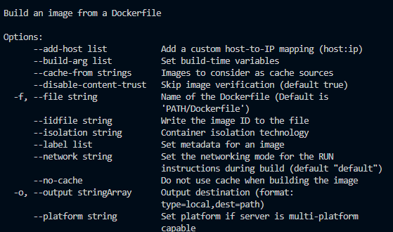
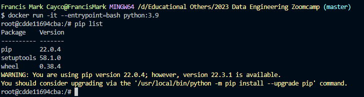
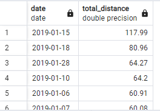
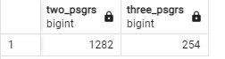
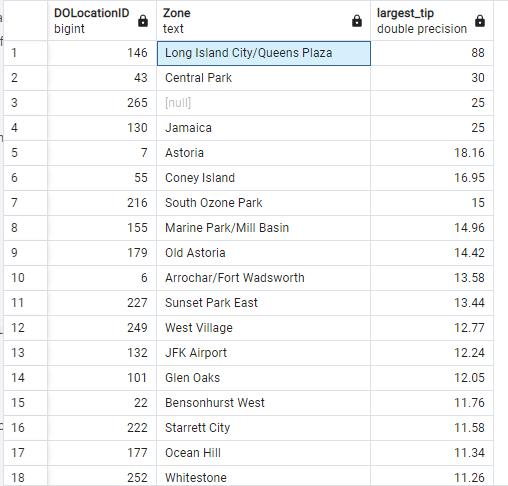

# Week 1 Homework Solutions


## Question 1. Knowing docker tags

Run the command to get information on Docker 

```docker --help```

Now run the command to get help on the "docker build" command

Which tag has the following text? - *Write the image ID to the file* 

- [ ] `--imageid string`
- [x] `--iidfile string`
- [ ] `--idimage string`
- [ ] `--idfile string`



## Question 2. Understanding docker first run 

Run docker with the python:3.9 image in an interactive mode and the entrypoint of bash.
Now check the python modules that are installed ( use pip list). 
How many python packages/modules are installed?

- [ ] 1
- [ ] 6
- [x] 3
- [ ] 7



## Question 3. Count records 

How many taxi trips were totally made on January 15?

Tip: started and finished on 2019-01-15. 

Remember that `lpep_pickup_datetime` and `lpep_dropoff_datetime` columns are in the format timestamp (date and hour+min+sec) and not in date.

- [ ] 20689
- [x] 20530
- [ ] 17630
- [ ] 21090

```
SELECT COUNT(*) FROM green_taxi_trips 
    WHERE date(lpep_pickup_datetime) = CAST('2019-01-15' AS DATE) 
    AND date(lpep_dropoff_datetime) = CAST('2019-01-15' AS DATE)
```

## Question 4. Largest trip for each day

Which was the day with the largest trip distance
Use the pick up time for your calculations.

- [ ] 2019-01-18
- [ ] 2019-01-28
- [X] 2019-01-15
- [ ] 2019-01-10

```
SELECT DATE(lpep_pickup_datetime),MAX(trip_distance) AS total_distance  
	FROM green_taxi_trips
GROUP BY DATE(lpep_pickup_datetime)
ORDER BY total_distance DESC
```


## Question 5. The number of passengers

In 2019-01-01 how many trips had 2 and 3 passengers?
 
- [ ] 2: 1282 ; 3: 266
- [ ] 2: 1532 ; 3: 126
- [x] 2: 1282 ; 3: 254
- [ ] 2: 1282 ; 3: 274
```
SELECT (SELECT COUNT(*) 
	FROM green_taxi_trips
WHERE DATE(lpep_pickup_datetime) = CAST('2019-01-01' AS DATE)
	AND passenger_count = 2) AS two_psgrs,
(SELECT COUNT(*) 
	FROM green_taxi_trips
WHERE DATE(lpep_pickup_datetime) = CAST('2019-01-01' AS DATE)
	AND passenger_count = 3) AS three_psgrs
```


## Question 6. Largest tip

For the passengers picked up in the Astoria Zone which was the drop off zone that had the largest tip?
We want the name of the zone, not the id.

Note: it's not a typo, it's `tip` , not `trip`

- [ ] Central Park
- [ ] Jamaica
- [ ] South Ozone Park
- [x] Long Island City/Queens Plaza

```
SELECT gtt."DOLocationID", tz."Zone", MAX(gtt.tip_amount) AS largest_tip
	FROM green_taxi_trips AS gtt
	LEFT JOIN taxi_zones AS tz
	ON gtt."DOLocationID" = tz."LocationID"
	WHERE "PULocationID" = (SELECT "LocationID" FROM taxi_zones WHERE "Zone" = 'Astoria')
	GROUP BY gtt."DOLocationID", tz."Zone"
	ORDER BY largest_tip DESC
```


## Part B
`cd ./terraform`

`terraform apply`

Output
```
  Francis Mark Cayco@FrancisMark MINGW64 /d/Educational Others/2023 Data Engineering Zoomcamp/terraform (master)
$ terraform apply
google_bigquery_dataset.dataset: Refreshing state... [id=projects/alert-ability-351416/datasets/trips_data_all]

Terraform used the selected providers to generate the following execution plan. Resource actions are indicated with the following symbols:
  + create
  ~ update in-place

Terraform will perform the following actions:

  # google_bigquery_dataset.dataset will be updated in-place
  ~ resource "google_bigquery_dataset" "dataset" {
      - default_partition_expiration_ms = 5184000000 -> null
      - default_table_expiration_ms     = 5184000000 -> null
        id                              = "projects/alert-ability-351416/datasets/trips_data_all"
        # (9 unchanged attributes hidden)

        # (4 unchanged blocks hidden)
    }

  # google_storage_bucket.data-lake-bucket will be created
  + resource "google_storage_bucket" "data-lake-bucket" {
      + force_destroy               = true
      + id                          = (known after apply)
      + location                    = "ASIA-EAST2"
      + name                        = "dtc_data_lake_alert-ability-351416"
      + project                     = (known after apply)
      + public_access_prevention    = (known after apply)
      + self_link                   = (known after apply)
      + storage_class               = "STANDARD"
      + uniform_bucket_level_access = true
      + url                         = (known after apply)

      + lifecycle_rule {
          + action {
              + type = "Delete"
            }

          + condition {
              + age                   = 30
              + matches_prefix        = []
              + matches_storage_class = []
              + matches_suffix        = []
              + with_state            = (known after apply)
            }
        }

      + versioning {
          + enabled = true
        }

      + website {
          + main_page_suffix = (known after apply)
          + not_found_page   = (known after apply)
        }
    }

Plan: 1 to add, 1 to change, 0 to destroy.

Do you want to perform these actions?
  Terraform will perform the actions described above.
  Only 'yes' will be accepted to approve.

  Enter a value: yes

google_storage_bucket.data-lake-bucket: Creating...
google_bigquery_dataset.dataset: Modifying... [id=projects/alert-ability-351416/datasets/trips_data_all]
google_bigquery_dataset.dataset: Creation complete after 1s [id=projects/alert-ability-351416/datasets/trips_data_all]
google_storage_bucket.data-lake-bucket: Creation complete after 1s [id=dtc_data_lake_alert-ability-351416]

Apply complete! Resources: 2 added, 0 changed, 0 destroyed.
```


