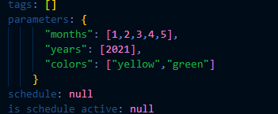

### Flow Deployment
`prefect deployment build ./path_to_python_file:method_name --name="Deployment Name"`

* In deployment_name-deployment.yaml file, modify the parameters:


* After deployment, time to apply
`prefect deployment apply path_to-deployment.yaml`

* You should be getting this log:
  ```
    Successfully loaded 'Parameterized ETL'
    Deployment 'etl-parent-flow/Parameterized ETL' successfully created with id 
    'b8595691-f737-46b1-b882-7228fc4ebafc'.

    To execute flow runs from this deployment, start an agent that pulls work from the  
    'default' work queue:
    $ prefect agent start -q 'default'
  ```
* Then run:
`prefect deployment run -n "Deployment Name" =p="parameter_name=parameter_value, paraneter_name_2=[1,2,3,4,5]"`

### Work Queues
* Basically u need a slave to run your deployments
`prefect agent start -q [work queue name]`
`prefect agent start -q "default"`

### Flow Scheduling
`prefect deployment build ./path_to_python_file:method_name --name="Deployment Name" --cron="* * * * *"`
[https://docs.oracle.com/cd/E12058_01/doc/doc.1014/e12030/cron_expressions.htm]("Cron Expressions Documentation")

* Alternatively, you can use the UI to schedule your flow


### "Coding" own deployments
* Kanina diba naka command siya, we can use python to do it
  ```
    docker_container_block = DockerContainer.load("prefect-docker-container")

    docker_dep = Deployment.build_from_flow(
        flow=etl_parent_flow,
        name = 'docker-flow',
        infrastructure = docker_container_block
    )
* However, in this case, we use the docker container block - a docker image - as the infrastructure to run the deployment.

* You may need to "interface" the docker container with the server itself:
  ` prefect config set PREFECT_API_URL="http://127.0.0.1:4200/api`

docker_dep.apply()
  ```
  
### Other Arguements:
`-a` - to automatically apply the deployment e.g. (`prefect deployment build ~~~ -a`) after building
`--help` - show documentation
