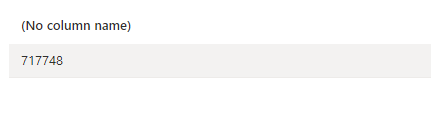

## Week 3 Homework
<b><u>Important Note:</b></u> <p>You can load the data however you would like, but keep the files in .GZ Format. 
If you are using orchestration such as Airflow or Prefect do not load the data into Big Query using the orchestrator.</br> 
Stop with loading the files into a bucket. </br></br>
<u>NOTE:</u> You can use the CSV option for the GZ files when creating an External Table</br>

<b>SETUP:</b></br>
Create an external table using the fhv 2019 data. </br>
Create a table in BQ using the fhv 2019 data (do not partition or cluster this table). </br>
Data can be found here: https://github.com/DataTalksClub/nyc-tlc-data/releases/tag/fhv </p>

Note 1:  Azure Synapse Analyics is used in my project.  
Note 2:  The data is stored in Azure Blob Storage.


CREATION OF EXTERNAL TABLE
```
    IF NOT EXISTS (SELECT * FROM sys.external_file_formats WHERE name = 'SynapseParquetFormat') 
        CREATE EXTERNAL FILE FORMAT [SynapseParquetFormat] 
        WITH ( FORMAT_TYPE = PARQUET)
    GO

    IF NOT EXISTS (SELECT * FROM sys.external_data_sources WHERE name = 'zoomcampcontainer_zoomcampsa_dfs_core_windows_net') 
        CREATE EXTERNAL DATA SOURCE [zoomcampcontainer_zoomcampsa_dfs_core_windows_net] 
        WITH (
            LOCATION = 'abfss://zoomcampcontainer@zoomcampsa.dfs.core.windows.net' 
        )
    GO

    CREATE EXTERNAL TABLE dbo.fhv_trip_data_2019 (
        [dispatching_base_num] nvarchar(4000),
        [pickup_datetime] nvarchar(4000),
        [dropOff_datetime] nvarchar(4000),
        [PUlocationID] float,
        [DOlocationID] float,
        [SR_Flag] float,
        [Affiliated_base_number] nvarchar(4000)
        )
        WITH (
        LOCATION = 'fhv_tripdata_2019.parquet',
        DATA_SOURCE = [zoomcampcontainer_zoomcampsa_dfs_core_windows_net],
        FILE_FORMAT = [SynapseParquetFormat]
        )
    GO
```
## Question 1:
What is the count for fhv vehicle records for year 2019?
- [ ] 65,623,481
- [x] 43,244,696
- [ ] 22,978,333
- [ ] 13,942,414


## Question 2:
Write a query to count the distinct number of affiliated_base_number for the entire dataset on both the tables.</br> 
What is the estimated amount of data that will be read when this query is executed on the External Table and the Table?

- [ ] 25.2 MB for the External Table and 100.87MB for the BQ Table
- [ ] 225.82 MB for the External Table and 47.60MB for the BQ Table
- [ ] 0 MB for the External Table and 0MB for the BQ Table
- [x] 0 MB for the External Table and 317.94MB for the BQ Table 

Personal Notes:
* In my case, the numerical quantities are not exact, but the order of magnitude is correct.

## Question 3:
How many records have both a blank (null) PUlocationID and DOlocationID in the entire dataset?
- [x] 717,748
- [ ] 1,215,687
- [ ] 5
- [ ] 20,332

```
    SELECT COUNT(*) FROM dbo.fhv_trip_data_2019 
    WHERE PUlocationID IS NULL AND DOlocationID IS NULL
    GO
```



## Question 4:
What is the best strategy to optimize the table if query always filter by pickup_datetime and order by affiliated_base_number?
- [ ] Cluster on pickup_datetime Cluster on affiliated_base_number
- [X] Partition by pickup_datetime Cluster on affiliated_base_number
- [ ] Partition by pickup_datetime Partition by affiliated_base_number
- [ ] Partition by affiliated_base_number Cluster on pickup_datetime

## Question 5:
Implement the optimized solution you chose for question 4. Write a query to retrieve the distinct affiliated_base_number between pickup_datetime 2019/03/01 and 2019/03/31 (inclusive).</br> 
Use the BQ table you created earlier in your from clause and note the estimated bytes. Now change the table in the from clause to the partitioned table you created for question 4 and note the estimated bytes processed. What are these values? Choose the answer which most closely matches.
- [ ] 12.82 MB for non-partitioned table and 647.87 MB for the partitioned table
- [x] 647.87 MB for non-partitioned table and 23.06 MB for the partitioned table
- [ ] 582.63 MB for non-partitioned table and 0 MB for the partitioned table
- [ ] 646.25 MB for non-partitioned table and 646.25 MB for the partitioned table

Personal Notes:
* Similar to question 2, the numerical quantities are not exact, but the order of magnitude is correct.
* Partitioned table significantly reduces the read data amount compared to the non-partitioned table.

## Question 6: 
Where is the data stored in the External Table you created?

- [ ] Big Query
- [X] GCP Bucket
- [ ] Container Registry
- [ ] Big Table

Only the metadata and schema is stored in Big Query. The data is stored in the GCP Bucket.

In my case, the data is stored in Azure Blob Storage while the metadata and schema is stored in Azure Synapse Analytics.


## Question 7:
It is best practice in Big Query to always cluster your data:
- [ ] True
- [x] False


## Question 8:
A better format to store these files may be parquet. Create a data pipeline to download the gzip files and convert them into parquet. Upload the files to your GCP Bucket and create an External and BQ Table. 

The solution for this data pipeline is located at `./flows/parameterized_yearly_flow.py`

Personal Note: 
* I used Azure Synapse Analytics instead of Big Query.
* Therefore, GCP Bucket -> Azure Blob Storage
* Dedicated SQL Pool (instead of serverless pool) is used to create local tables and external tables.


Column types for all files used in an External Table must have the same datatype. While an External Table may be created and shown in the side panel in Big Query, this will need to be validated by running a count query on the External Table to check if any errors occur. 
 
