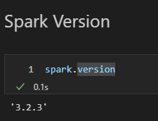
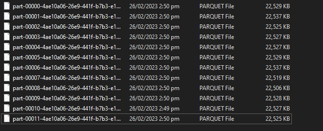
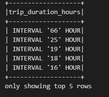
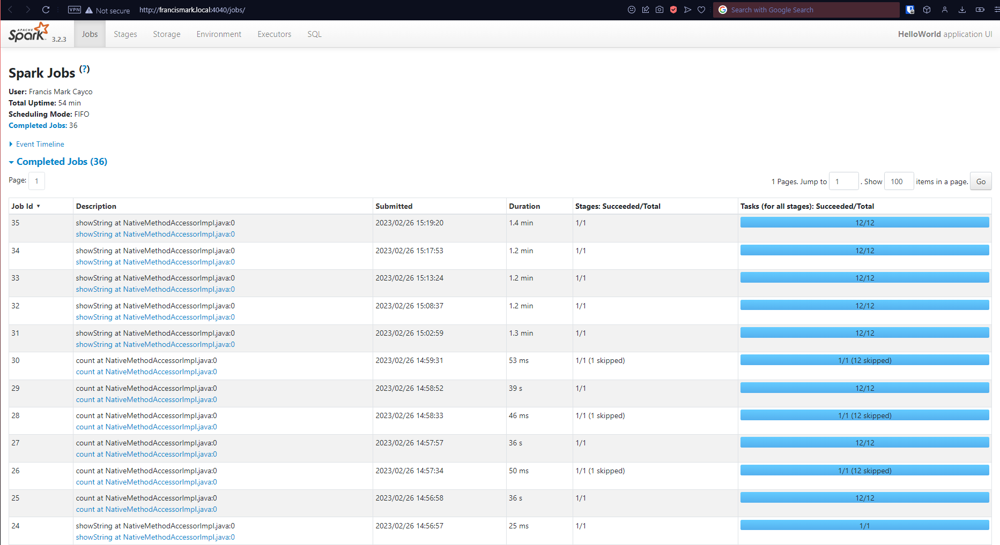
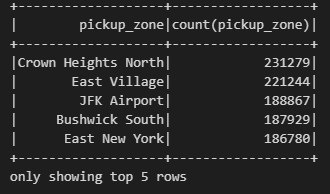

## Week 5 Homework 
For this homework we will be using the FHVHV 2021-06 data found here. [FHVHV Data](https://github.com/DataTalksClub/nyc-tlc-data/releases/download/fhvhv/fhvhv_tripdata_2021-06.csv.gz )

### Question 1: 
**Install Spark and PySpark** 

- Install Spark
- Run PySpark
- Create a local spark session
- Execute spark.version.

What's the output?
- [x] 3.3.2
- [ ] 2.1.4
- [ ] 1.2.3
- [ ] 5.4



Note: I am using Spark 3.2.3.  The video instruction has 3.3.3 installed.

### Question 2: 

**HVFHW June 2021**

Read it with Spark using the same schema as we did in the lessons.</br> 
We will use this dataset for all the remaining questions.</br>
Repartition it to 12 partitions and save it to parquet.</br>
What is the average size of the Parquet (ending with .parquet extension) Files that were created (in MB)? Select the answer which most closely matches.</br>

- [ ] 2MB
- [x] 24MB
- [ ] 100MB
- [ ] 250MB

`Average file size is: 23066452.333333332 bytes`



### Question 3: 

**Count records**  

How many taxi trips were there on June 15?</br></br>
Consider only trips that started on June 15.</br>

- [ ] 308,164
- [ ] 12,856
- [x] 452,470
- [ ] 50,982

```
taxi_trips_count = df_fvhv.where("DAY(pickup_datetime) == 15").count()
Number of taxi trips on 15th June 2021: 452470
```
### Question 4: 
**Longest trip for each day**  

Now calculate the duration for each trip.</br>
How long was the longest trip in Hours?</br>

- [x] 66.87 Hours
- [ ] 243.44 Hours
- [ ] 7.68 Hours
- [ ] 3.32 Hours

```
SELECT 
    CAST(dropoff_datetime - pickup_datetime AS INTERVAL HOUR) AS trip_duration_hours
FROM
    df_fvhv
ORDER BY
    trip_duration_hours DESC
```


### Question 5: 

**User Interface**

 Spark’s User Interface which shows application's dashboard runs on which local port?</br>

- [ ] 80
- [ ] 443
- [x] 4040
- [ ] 8080
</br></br>



### Question 6: 

**Most frequent pickup location zone**

Load the zone lookup data into a temp view in Spark</br>
[Zone Data](https://github.com/DataTalksClub/nyc-tlc-data/releases/download/misc/taxi_zone_lookup.csv)</br>

Using the zone lookup data and the fhvhv June 2021 data, what is the name of the most frequent pickup location zone?</br>

- [ ] East Chelsea
- [ ] Astoria
- [ ] Union Sq
- [x] Crown Heights North
</br></br>

```
df_fvhv_full = spark.sql("""
    SELECT
        df_fvhv.dispatching_base_num,
        df_fvhv.pickup_datetime,
        df_fvhv.dropoff_datetime,
        pickup_zone.Borough AS pickup_borough,
        pickup_zone.Zone AS pickup_zone,
        dropoff_zone.Borough AS dropoff_borough,
        dropoff_zone.Zone AS dropoff_zone,
        df_fvhv.SR_Flag,
        df_fvhv.Affiliated_base_number
    FROM df_fvhv
    INNER JOIN taxi_zone_lookpup AS pickup_zone
        ON pickup_zone.LocationID = df_fvhv.PULocationID
    INNER JOIN taxi_zone_lookpup AS dropoff_zone
        ON dropoff_zone.LocationID = df_fvhv.DOLocationID
""")   

df_fvhv_full.printSchema()
df_fvhv_full.createOrReplaceTempView("df_fvhv_full")

spark.sql("""
    SELECT 
        pickup_zone, 
        COUNT(pickup_zone)
    FROM 
        df_fvhv_full
    GROUP BY pickup_zone
    ORDER BY COUNT(pickup_zone) DESC
""").show(5)

```

